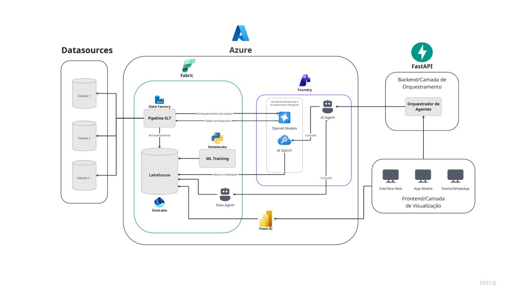

# Assistente de Manutenção

Assistente de IA da Área de Manutenção da Wheaton Brasil Vidros. Responde, em linguagem
natural, perguntas analíticas sobre Ordens de Serviço, equipamentos e histórico de
manutenção — consultas que antes exigiam de 20 a 30 minutos de consolidação manual em
planilhas e hoje levam de 3 a 4 minutos.

Em operação há 3 meses com dados reais de produção, em uso pelo key user da área
(Lucas Santos, Programador de Manutenção), com mais de 200 consultas realizadas.

## Arquitetura



Os datasets de origem são ingeridos por um pipeline ELT no Data Factory e armazenados
no Lakehouse (OneLake). A camada de recuperação e enriquecimento inteligente combina
Azure OpenAI e AI Search sobre esses dados indexados, e o AI Agent do Foundry consulta
tanto essa camada quanto o Data Agent do Fabric. O backend FastAPI atua como
orquestrador de agentes entre o frontend e o Azure. O Power BI lê o mesmo Lakehouse
para acompanhamento gerencial.

> O diagrama representa a arquitetura-alvo. A interface web é o canal em operação hoje;
> app mobile, Teams/WhatsApp, ML Training e Power BI são evolução prevista, e o caminho
> em uso atualmente é o descrito abaixo.

## Como funciona

Fluxo de uma pergunta, hoje:

```
Navegador  →  Next.js (/api/chat)  →  FastAPI (/data-agent/query)  →  Fabric Data Agent (MCP)
```

1. O frontend envia o histórico da conversa para sua própria rota `/api/chat`.
2. Essa rota extrai a última pergunta do usuário e repassa ao backend FastAPI.
3. O backend autentica no Azure (client credentials), abre uma sessão MCP contra o
   Data Agent do Microsoft Fabric e executa a pergunta.
4. A resposta volta em texto e é devolvida ao navegador em streaming palavra a palavra,
   para dar o efeito de digitação.

Hoje o Data Agent opera sobre uma base alimentada por **exportações manuais do GCM**.
A conexão direta ao banco do GCM (somente leitura) é o escopo da Fase 2.

## Stack

| Camada | Tecnologia |
| --- | --- |
| Frontend | Next.js 16, React 19, TypeScript, Tailwind CSS 4, react-markdown |
| Backend | Python 3.13, FastAPI, Uvicorn |
| IA / dados | Azure Foundry Agent Service, Azure OpenAI, Microsoft Fabric (Data Agent + OneLake), Azure AI Search |
| Autenticação | `azure-identity` (ClientSecretCredential) |
| Execução | Docker Compose |

## Estrutura

```
assistant-app/
├── backend/ai-integration/
│   ├── main.py                      # API FastAPI — POST /data-agent/query
│   ├── service/azure_integration.py # Token do Azure + sessão MCP com o Fabric Data Agent
│   ├── pyproject.toml               # Dependências reais usadas no build
│   └── Dockerfile
├── frontend/
│   ├── app/page.tsx                 # Tela do chat
│   ├── app/api/chat/route.ts        # Proxy para o backend + streaming da resposta
│   ├── app/components/              # ChatInput, MessageBubble, EmptyState, Mascote
│   └── Dockerfile
├── docs/arquitetura.png             # Diagrama da arquitetura
├── docker-compose.yml
└── DOCKER.md                        # Detalhes de build, cache e comandos do Docker
```

## Configuração

Crie `backend/ai-integration/.env` com as credenciais do app registrado no Entra ID:

```
AZURE_TENANT_ID=...
AZURE_CLIENT_ID=...
AZURE_CLIENT_SECRET=...
```

O frontend usa a variável `BACKEND_URL` (padrão: `http://localhost:8000/data-agent/query`);
no Compose ela já aponta para `http://backend:8000/data-agent/query`.

A URL do workspace e do Data Agent no Fabric está fixa em
`service/azure_integration.py` (`FABRIC_MCP_URL`).

## Executando

### Com Docker (recomendado)

```bash
docker compose up --build
```

- Frontend: http://localhost:3005
- Backend (Swagger): http://localhost:8000/docs

Para parar: `Ctrl+C` e `docker compose down`. Veja [DOCKER.md](DOCKER.md) para quando
usar `--build`, `--no-cache` e rebuild de um serviço só.

### Local, sem Docker

Backend:

```bash
cd backend/ai-integration
pip install "fastapi[standard]" azure-identity mcp python-dotenv uvicorn
uvicorn main:app --reload --port 8000
```

> `requirements.txt` é um `pip freeze` do ambiente Windows do desenvolvedor e não
> instala em Linux. As dependências reais do serviço estão no `pyproject.toml`.

Frontend:

```bash
cd frontend
npm install
npm run dev
```

## API

**`POST /data-agent/query`**

```json
{ "question": "Última OS do Forno B" }
```

```json
{ "answer": "..." }
```

Para testar a integração com o Fabric sem subir a API:

```bash
python backend/ai-integration/service/azure_integration.py
```

## Casos de uso cobertos

Consulta de OS, ranking de falhas, MTTR e MTBF, histórico por ativo, ocorrências em
aberto e recomendações preventivas, entre outros — 10 casos priorizados e validados
no piloto.

## Roadmap

- **Fase 1 — concluída.** MVP em operação com dados reais, 10 casos de uso, frontend
  validado com a área.
- **Fase 2 — próximo trimestre.** Conexão direta somente leitura ao banco do GCM,
  abertura gradual para a equipe de Manutenção, medição de adoção e de qualidade das
  respostas.
- **Fase 3.** Recomendações preventivas a partir do histórico de falhas, alertas de
  ativos críticos, detecção de anomalias e integração com Power BI.

## Manutenção

Desenvolvimento e evolução: Lucas Garcia. Credenciais, controles de acesso e validação
de compliance: TI.
